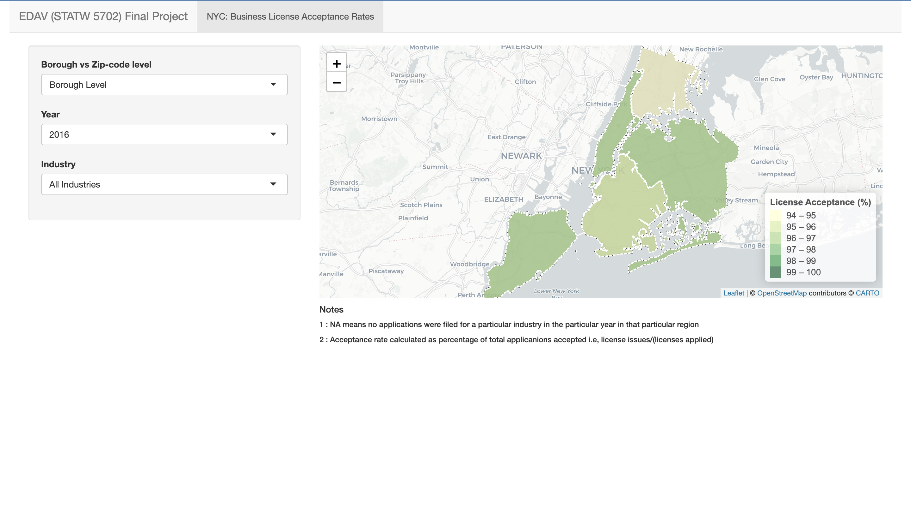

# Interactive component

## NYC Business License Acceptance Rates

<!--  -->

(Click this [LINK](https://definitely-arnav.shinyapps.io/NYC_Business_License_Acceptance_Rates/) or the above image to open the app in a browser)

For the interactive component we created a geospatial heatmap that displays the acceptance rates across different boroughs and zipcodes. We have bundled this heatmap into a shiny app and deployed it using the servers offered by shinyapps.io. Anyone can use the link above to access the app and play around with different industries and years that they want to dive deep on.

Through this app we wanted the users to study and explore for themselves what areas (both at borough and zipcode level) have had lower acceptance rates as compared to their peers. For instance, we can see that Bronx has had marginally lower license acceptance rates as compared to other boroughs throughout the last 7 years across most industries.

Dataset used: We have used the Business License Applications dataset to create the visualizations here. Though the data contains information on licenses dating back to the year 2000, the information is pretty much sparse. Hence, for the app to produce any meaningful visualizations we have only used the data starting from 2014 going upto 2021.

 
Tools & packages used: R Shiny, Leaflet, D3.js, mapview, raster 